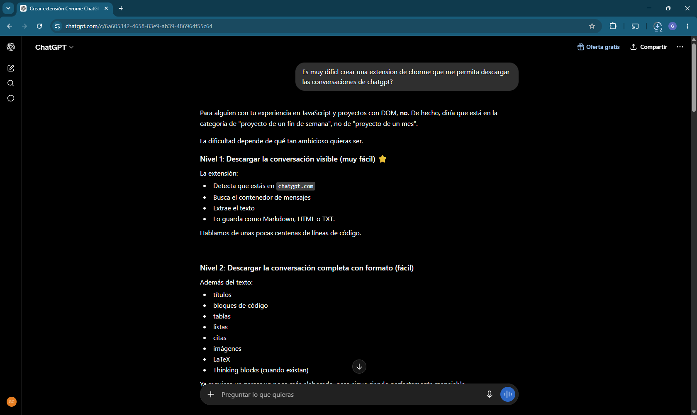
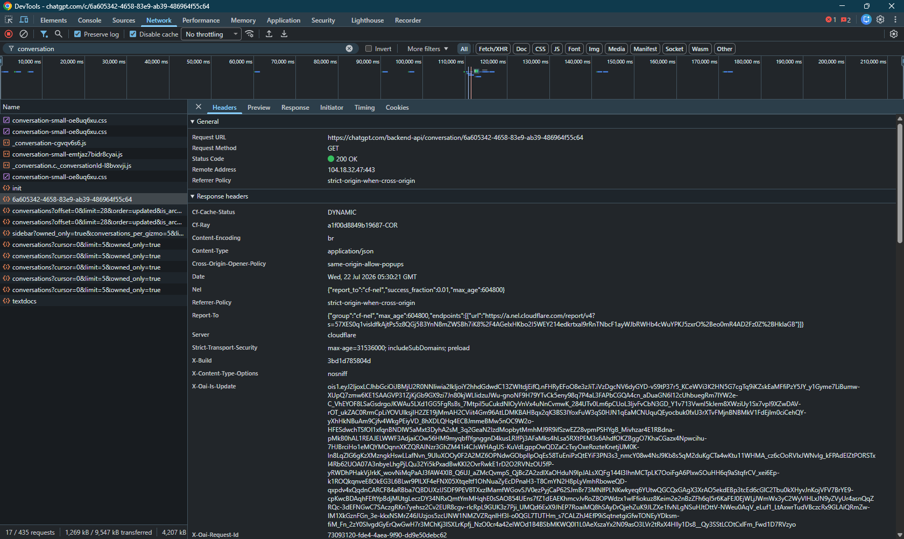
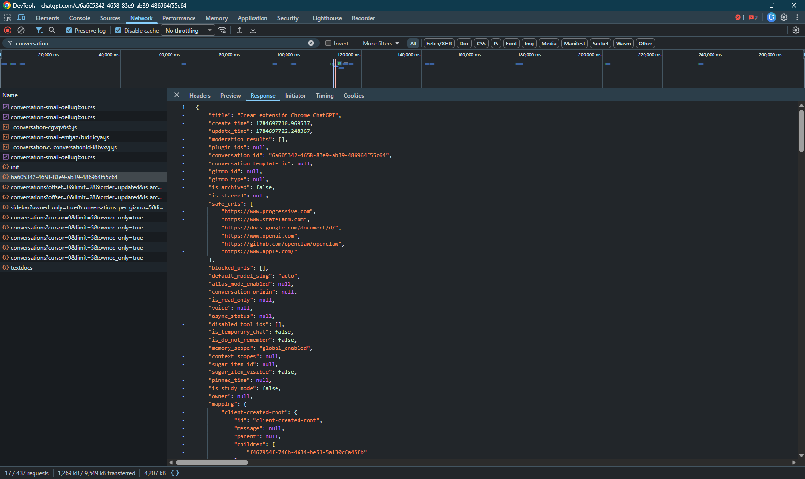

# AI Chat Exporter

> Convierte conversaciones exportadas desde plataformas de inteligencia artificial en documentos Markdown abiertos, legibles y reutilizables.

AI Chat Exporter nació con un objetivo simple: preservar conversaciones de inteligencia artificial en un formato abierto, legible e independiente de la plataforma donde fueron creadas.

Actualmente permite procesar conversaciones exportadas desde ChatGPT a partir de su archivo JSON oficial y convertirlas en documentos Markdown limpios, preservando la estructura, el orden y el contexto mediante un pipeline modular y desacoplado.

Aunque hoy el proyecto soporta ChatGPT y Markdown, su arquitectura fue diseñada para crecer hacia nuevos asistentes, nuevos formatos de exportación y futuras integraciones sin reescribir el núcleo de la aplicación.

---

# Índice

- [Estado](#estado)
- [Características](#características)
- [Requisitos](#requisitos)
- [Instalación](#instalación)
- [Obtener una conversación desde ChatGPT](#obtener-una-conversación-desde-chatgpt)
- [Uso](#uso)
- [Testing](#testing)
- [Arquitectura](#arquitectura)
- [Estructura del proyecto](#estructura-del-proyecto)
- [Documentación](#documentación)
- [Evolución futura](#evolución-futura)
- [Filosofía del proyecto](#filosofía-del-proyecto)
- [Licencia](#licencia)

---

# Estado

- ✅ Stable release (v1.0.0)
- ✅ Soporte para ChatGPT
- ✅ Exportación a Markdown
- ✅ Suite de pruebas automatizadas

---

# Características

- Conversión de conversaciones exportadas desde ChatGPT a Markdown.
- Pipeline modular y desacoplado.
- Interfaz de línea de comandos (CLI).
- Modo `--inspect`.
- Modo `--no-write`.
- Modo `--compact`.
- Sin dependencias externas de npm.
- Suite de pruebas automatizadas por módulo.
- Documentación técnica completa.

---

# Requisitos

- Node.js 20 o superior.

---

# Instalación

```bash
git clone https://github.com/GuillermoCochrane/chat-exporter.git

cd chat-exporter
```

El proyecto no requiere instalar dependencias externas de npm.

---

# Obtener una conversación desde ChatGPT

1. [Abrir la conversación](#paso-1--abrir-la-conversación)
2. [Abrir DevTools](#paso-2--abrir-devtools)
3. [Recargar la página](#paso-3--recargar-la-página)
4. [Buscar la petición](#paso-4--buscar-la-petición)
5. [Abrir la respuesta](#paso-5--abrir-la-respuesta)
6. [Copiar la respuesta](#paso-6--copiar-la-respuesta)
7. [Guardar el archivo](#paso-7--guardar-el-archivo)
8. [Exportar](#paso-8--exportar)

Actualmente ChatGPT no ofrece un archivo JSON descargable para una conversación individual.

AI Chat Exporter utiliza el mismo JSON que recibe la aplicación web durante la carga inicial de una conversación.

---

## Paso 1 — Abrir la conversación

Abrí la conversación que querés exportar desde ChatGPT Web.



---

## Paso 2 — Abrir DevTools

Presioná:

```text
F12
```

o

```text
Ctrl + Shift + I
```

Luego seleccioná la pestaña **Network**.


---

## Paso 3 — Recargar la página

Con la pestaña **Network** abierta, recargá la conversación.

```text
F5
```

o utilizando el botón de recarga del navegador.

Esto permitirá capturar la petición que contiene la conversación.

---

## Paso 4 — Buscar la petición

Buscá la petición cuyo nombre contiene:

```text
conversation
```

Generalmente aparecerá como una petición de tipo **Fetch/XHR**.



---

## Paso 5 — Abrir la respuesta

Seleccioná la petición y abrí la pestaña:

```text
Response
```

Allí aparecerá el documento JSON completo.



---

## Paso 6 — Copiar la respuesta

Hacé clic derecho dentro del contenido y seleccioná:

```text
Copy response
```


---

## Paso 7 — Guardar el archivo

Pegá el contenido en un archivo llamado:

```text
conversation.json
```

y guardalo dentro del directorio:

```text
input/
└── conversation.json
```

---

## Paso 8 — Exportar

Desde la raíz del proyecto ejecutá:

```bash
npm start
```

El documento Markdown será generado automáticamente en:

```text
output/conversacion.md
```

---

# Uso

## Exportación básica

```bash
npm start
```

Por defecto el proyecto:

- lee la conversación desde `input/conversation.json`;
- genera el archivo `output/conversacion.md`.

## Archivo de entrada personalizado

```bash
npm start -- -i input/conversation.json
```

## Archivo de salida personalizado

```bash
npm start -- -i input/conversation.json -o output/prueba.md
```

## Modo compacto

```bash
npm start -- -i input/conversation.json -o output/prueba.md -c
```

## Inspeccionar una conversación

```bash
npm start -- --inspect
```

## Ejecutar el pipeline sin escribir archivos

```bash
npm start -- --no-write
```

---

# Testing

Ejecutar toda la suite:

```bash
npm test
```

Ejecutar una batería específica:

```bash
npm run test:loader
npm run test:writer
npm run test:markdown
...
```

Actualmente existen pruebas automatizadas para:

- Formatter
- Validator
- Parser
- Filter
- Normalizer
- Markdown
- Loader
- Writer

---

# Arquitectura

La aplicación se organiza mediante un pipeline claramente definido:

```text
JSON
 ↓
Loader
 ↓
Inspector
 ↓
Parser
 ↓
Filter
 ↓
Normalizer
 ↓
Formatter
 ↓
Markdown Builder
 ↓
Writer
```

Cada módulo posee una única responsabilidad y puede evolucionar de forma independiente.

---

# Estructura del proyecto

```text
src/
├── core/
│   ├── filter.js
│   ├── index.js
│   ├── inspector.js
│   ├── loader.js
│   ├── markdown.js
│   ├── normalizer.js
│   ├── parser.js
│   └── writer.js
│
├── interfaces/
│   └── cli.js
│
├── utilities/
│   ├── formatter.js
│   └── validator.js
│
└── main.js
```

---

# Documentación

La documentación está organizada por responsabilidad.

| Documento | Propósito |
|-----------|-----------|
| [ROADMAP](docs/ROADMAP.md) | Estado actual y planificación del proyecto. |
| [CHANGELOG](docs/CHANGELOG.md) | Historial completo de versiones. |
| [ARCHITECTURE](docs/ARCHITECTURE.md) | Organización interna del sistema. |
| [DECISIONS](docs/DECISIONS.md) | Registro de decisiones de arquitectura (ADR). |
| [LABORATORY](docs/LABORATORY.md) | Hipótesis, experimentos y descubrimientos durante el desarrollo. |
| [MANUAL-TESTING](docs/MANUAL-TESTING.md) | Casos de prueba manuales. |

## Primera vez en el proyecto

Se recomienda recorrer la documentación en el siguiente orden:

1. README
2. ROADMAP
3. ARCHITECTURE
4. DECISIONS
5. LABORATORY

Cada documento responde una pregunta distinta y evita duplicar información.

---

# Estado de la versión 1.0.0

La versión **1.0.0** representa la primera versión estable del proyecto.

Incluye:

- soporte para conversaciones exportadas desde ChatGPT;
- exportación a Markdown;
- arquitectura modular y desacoplada;
- suite de pruebas automatizadas;
- documentación técnica completa.

---

# Evolución futura

Entre las funcionalidades previstas se encuentran:

- Exportación HTML.
- Exportación PDF.
- Exportación Obsidian.
- Soporte para Gemini.
- Soporte para Claude.
- Soporte para DeepSeek.
- Soporte para Google AI.
- Extensión para Chrome.
- Configuración avanzada de formatos.
- Templates de Markdown.

---

# Filosofía del proyecto

AI Chat Exporter prioriza:

- Arquitectura modular.
- Responsabilidad única por módulo.
- Bajo acoplamiento.
- Evolución incremental.
- Documentación como parte del desarrollo.
- Pruebas automatizadas para preservar el comportamiento.

El objetivo no es únicamente convertir conversaciones entre formatos. La visión del proyecto es construir una base sólida que permita preservar conversaciones de inteligencia artificial en formatos abiertos, facilitando su reutilización e incorporando nuevas plataformas y nuevos formatos sin comprometer el núcleo de la aplicación.

---

# Licencia

MIT License.