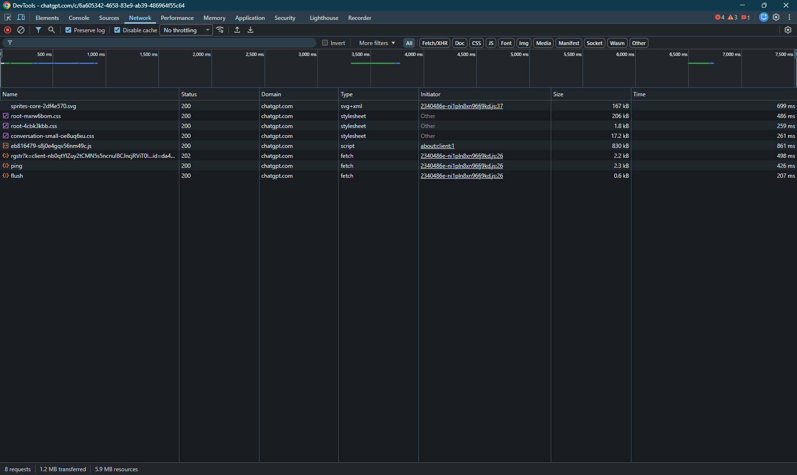
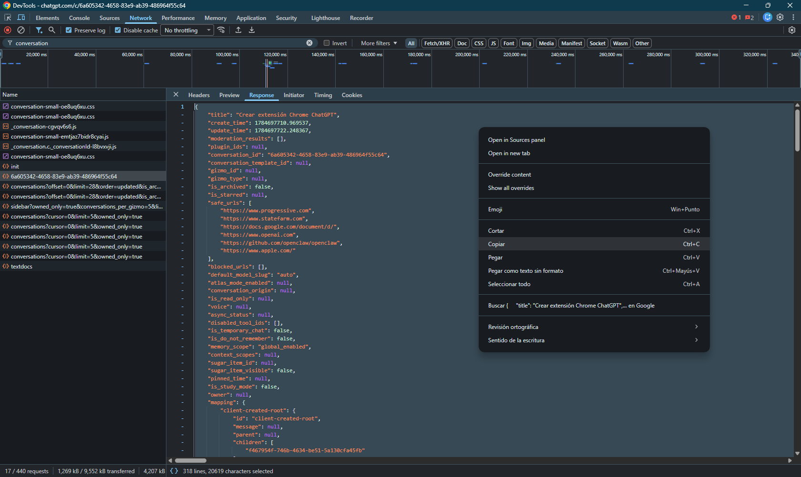

# AI Chat Exporter

> Convierte conversaciones exportadas desde plataformas de inteligencia artificial en documentos Markdown abiertos, legibles y reutilizables.

AI Chat Exporter nació con un objetivo simple: preservar conversaciones de inteligencia artificial en un formato abierto, legible e independiente de la plataforma donde fueron creadas.

Actualmente permite procesar conversaciones exportadas desde ChatGPT a partir de su archivo JSON oficial y convertirlas en documentos Markdown limpios, preservando la estructura, el orden y el contexto mediante un pipeline modular y desacoplado.

El proyecto ofrece dos interfaces que comparten el mismo motor: una CLI para procesar archivos JSON locales y una extensión de Chrome que captura y exporta conversaciones directamente desde el navegador.

Aunque hoy el proyecto soporta ChatGPT y Markdown, su arquitectura fue diseñada para crecer hacia nuevos asistentes, nuevos formatos de exportación y futuras integraciones sin reescribir el núcleo de la aplicación.

---

# Índice

- [AI Chat Exporter](#ai-chat-exporter)
- [Índice](#índice)
- [Estado](#estado)
- [Características](#características)
- [Requisitos](#requisitos)
- [Instalación](#instalación)
- [Extensión de Chrome](#extensión-de-chrome)
  - [Build](#build)
  - [Instalación en Chrome](#instalación-en-chrome)
  - [Uso](#uso)
- [Obtener una conversación desde ChatGPT](#obtener-una-conversación-desde-chatgpt)
  - [Paso 1 — Abrir la conversación](#paso-1--abrir-la-conversación)
  - [Paso 2 — Abrir DevTools](#paso-2--abrir-devtools)
  - [Paso 3 — Recargar la página](#paso-3--recargar-la-página)
  - [Paso 4 — Buscar la petición](#paso-4--buscar-la-petición)
  - [Paso 5 — Abrir la respuesta](#paso-5--abrir-la-respuesta)
  - [Paso 6 — Copiar la respuesta](#paso-6--copiar-la-respuesta)
  - [Paso 7 — Guardar el archivo](#paso-7--guardar-el-archivo)
  - [Paso 8 — Exportar](#paso-8--exportar)
- [Uso](#uso-1)
  - [Exportación básica](#exportación-básica)
  - [Archivo de entrada personalizado](#archivo-de-entrada-personalizado)
  - [Archivo de salida personalizado](#archivo-de-salida-personalizado)
  - [Modo compacto](#modo-compacto)
  - [Inspeccionar una conversación](#inspeccionar-una-conversación)
  - [Ejecutar el pipeline sin escribir archivos](#ejecutar-el-pipeline-sin-escribir-archivos)
- [Testing](#testing)
- [Arquitectura](#arquitectura)
- [Estructura del proyecto](#estructura-del-proyecto)
- [Documentación](#documentación)
  - [Documentación de la extensión](#documentación-de-la-extensión)
- [Evolución futura](#evolución-futura)
- [Filosofía del proyecto](#filosofía-del-proyecto)
- [Licencia](#licencia)

---

# Estado

- ✅ Versión estable 1.1.4
- ✅ CLI funcional
- ✅ Extensión de Chrome integrada
- ✅ Soporte para ChatGPT
- ✅ Exportación a Markdown
- ✅ Suite de pruebas automatizadas

---

# Características

- Conversión de conversaciones exportadas desde ChatGPT a Markdown.
- Pipeline modular y desacoplado.
- Interfaz de línea de comandos (CLI).
- Extensión de Chrome que captura conversaciones automáticamente y exporta Markdown.
- Modo `--inspect`.
- Modo `--no-write`.
- Modo `--compact`.
- Build automatizado de la extensión con esbuild.
- Suite de pruebas automatizadas por módulo.
- Documentación técnica completa.

---

# Requisitos

- Node.js 20 o superior.

---

# Instalación

```bash
git clone https://github.com/GuillermoCochrane/chat-exporter.git

cd chat-exporter

npm install
```

El proyecto solo requiere `esbuild` como dependencia de desarrollo para construir la extensión. El core de la CLI funciona sin dependencias externas de npm.

---

# Extensión de Chrome

La extensión captura automáticamente el JSON de cualquier conversación de ChatGPT y la exporta a Markdown utilizando el mismo pipeline que la CLI.

## Build

```bash
npm run build:extension
```

Esto genera la carpeta `dist/` con todos los archivos necesarios.

## Instalación en Chrome

1. Abrí `chrome://extensions/`.
2. Activá **Modo de desarrollador**.
3. Click en **Cargar descomprimida**.
4. Seleccioná la carpeta `dist/`.

## Uso

1. Andá a `https://chatgpt.com/` y abrí una conversación.
2. Click en el ícono de la extensión.
3. El archivo `conversacion.md` se descargará automáticamente.

---

# Obtener una conversación desde ChatGPT

1. [Abrir la conversación](#paso-1--abrir-la-conversación)
2. [Abrir DevTools](#paso-2--abrir-devtools)
3. [Recargar la página](#paso-3--recargar-la-página)
4. [Buscar la petición](#paso-4--buscar-la-petición)
5. [Abrir la respuesta](#paso-5--abrir-la-respuesta)
6. [Copiar la respuesta](#paso-6--copiar-la-respuesta)
7. [Guardar el archivo](#paso-7--guardar-el-archivo)
8. [Exportar](#paso-8--exportar)

Actualmente ChatGPT no ofrece un archivo JSON descargable para una conversación individual.

AI Chat Exporter utiliza el mismo JSON que recibe la aplicación web durante la carga inicial de una conversación.

---

## Paso 1 — Abrir la conversación

Abrí la conversación que querés exportar desde ChatGPT Web.


---

## Paso 2 — Abrir DevTools

Presioná:

```text
F12
```

o

```text
Ctrl + Shift + I
```

Luego seleccioná la pestaña **Network**.



---

## Paso 3 — Recargar la página

Con la pestaña **Network** abierta, recargá la conversación.

```text
F5
```

o utilizando el botón de recarga del navegador.

Esto permitirá capturar la petición que contiene la conversación.

---

## Paso 4 — Buscar la petición

Buscá la petición cuyo nombre contiene:

```text
conversation
```

Generalmente aparecerá como una petición de tipo **Fetch/XHR**.


---

## Paso 5 — Abrir la respuesta

Seleccioná la petición y abrí la pestaña:

```text
Response
```

Allí aparecerá el documento JSON completo.


---

## Paso 6 — Copiar la respuesta

Hacé clic derecho dentro del contenido y seleccioná:

```text
Copy response
```



---

## Paso 7 — Guardar el archivo

Pegá el contenido en un archivo llamado:

```text
conversation.json
```

y guardalo dentro del directorio:

```text
assets/input/
└── conversation.json
```

---

## Paso 8 — Exportar

Desde la raíz del proyecto ejecutá:

```bash
npm start
```

El documento Markdown será generado automáticamente en:

```text
assets/output/conversacion.md
```

---

# Uso

## Exportación básica

```bash
npm start
```

Por defecto el proyecto:

- lee la conversación desde `assets/input/conversation.json`;
- genera el archivo `assets/output/conversacion.md`.

## Archivo de entrada personalizado

```bash
npm start -- -i assets/input/conversation.json
```

## Archivo de salida personalizado

```bash
npm start -- -i assets/input/conversation.json -o assets/output/prueba.md
```

## Modo compacto

```bash
npm start -- -i assets/input/conversation.json -o assets/output/prueba.md -c
```

## Inspeccionar una conversación

```bash
npm start -- --inspect
```

## Ejecutar el pipeline sin escribir archivos

```bash
npm start -- --no-write
```

---

# Testing

Ejecutar toda la suite:

```bash
npm test
```

Ejecutar una batería específica:

```bash
npm run test:formatter
npm run test:validator
npm run test:parser
npm run test:filter
npm run test:normalizer
npm run test:markdown
npm run test:markdown:compact
npm run test:loader
npm run test:writer
```

Actualmente existen pruebas automatizadas para:

- Formatter
- Validator
- Parser
- Filter
- Normalizer
- Markdown
- Markdown (modo compacto)
- JsonFileSource
- Writer

---

# Arquitectura

La aplicación se organiza en capas desacopladas:

```text
Interface (CLI / Chrome Extension)
        │
        ▼
Pipeline Profile
        │
        ▼
Pipeline Config
        │
        ▼
runExporter
        │
        ▼
Conversation Source
        │
        ▼
Conversation
        │
        ▼
runPipeline
   ┌────────────┐
   │ Inspector  │
   │ Parser     │
   │ Filter     │
   │ Normalizer │
   └────────────┘
        │
        ▼
Renderer (Markdown)
        │
        ▼
Output (Archivo / Descarga)
```

Cada módulo posee una única responsabilidad. El Core desconoce el origen de la conversación, la interfaz que inició el proceso y el destino final del resultado.

---

# Estructura del proyecto

```text
src/
├── main.js
├── configuration/
│   ├── pipelineConfig.js
│   └── pipelineProfiles.js
├── core/
│   ├── exporter.js
│   ├── pipeline.js
│   ├── inspector.js
│   ├── parser.js
│   ├── filter.js
│   ├── normalizer.js
│   ├── markdown.js
│   ├── writer.js
│   ├── sources/
│   │   ├── index.js
│   │   ├── jsonFile.js
│   │   ├── jsonFile.stub.js
│   │   └── extensionSource.js
│   ├── renderers/
│   └── outputs/
├── interfaces/
│   ├── cli.js
│   └── extension/
│       ├── background.js
│       ├── content.js
│       ├── extensionCore.js
│       ├── inject.js
│       └── manifest.json
└── utilities/
    ├── formatter.js
    └── validator.js
```

---

# Documentación

La documentación está organizada por responsabilidad.

| Documento | Propósito |
|-----------|-----------|
| [ROADMAP](docs/ROADMAP.md) | Estado actual y planificación del proyecto. |
| [CHANGELOG](docs/CHANGELOG.md) | Historial completo de versiones. |
| [ARCHITECTURE](docs/ARCHITECTURE.md) | Organización interna del sistema. |
| [DATA_FLOW](docs/DATA_FLOW.md) | Recorrido conceptual de los datos. |
| [INTEGRATION](docs/INTEGRATION.md) | Contratos entre interfaces y Core. |
| [DECISIONS](docs/DECISIONS.md) | Registro de decisiones de arquitectura (ADR). |
| [LABORATORY](docs/LABORATORY.md) | Hipótesis, experimentos y descubrimientos. |
| [MANUAL-TESTING](docs/MANUAL-TESTING.md) | Casos de prueba manuales. |

## Documentación de la extensión

| Documento | Propósito |
|-----------|-----------|
| [ROADMAP](docs/extension/ROADMAP.md) | Estado y fases de la extensión. |
| [ARCHITECTURE](docs/extension/ARCHITECTURE.md) | Diseño interno de la extensión. |
| [CAPTURE_RESEARCH](docs/extension/CAPTURE_RESEARCH.md) | Investigación sobre la captura del JSON. |

---

# Evolución futura

Entre las funcionalidades previstas se encuentran:

- Exportación HTML.
- Exportación PDF.
- Exportación Obsidian.
- Soporte para Gemini.
- Soporte para Claude.
- Soporte para DeepSeek.
- Soporte para Google AI.
- API REST.
- Aplicación de escritorio.
- Configuración avanzada de formatos.
- Templates de Markdown.

---

# Filosofía del proyecto

AI Chat Exporter prioriza:

- Arquitectura modular.
- Responsabilidad única por módulo.
- Bajo acoplamiento.
- Evolución incremental.
- Documentación como parte del desarrollo.
- Pruebas automatizadas para preservar el comportamiento.

El objetivo no es únicamente convertir conversaciones entre formatos. La visión del proyecto es construir una base sólida que permita preservar conversaciones de inteligencia artificial en formatos abiertos, facilitando su reutilización e incorporando nuevas plataformas y nuevos formatos sin comprometer el núcleo de la aplicación.

---

# Licencia

MIT License.

---
